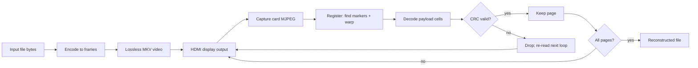

# HDMI File Transporter - Encoding & Resilience Findings

A deep, self-contained record of the encoding work and benchmark discoveries.
It documents how the transport works, the four encoding modes (including the two
added today: quantized-RGB and brightness/luma), why dense encodings fail over a
real capture path, the full benchmark methodology, and every result table.

All numbers come from benchmark runs on this machine at 1920x1080 / 1280x720
using the simulated capture pipeline described in section 5.

---

## 1. Overview: how the transport works

The goal is to move a file (e.g. a `.zip`) from one machine to another over an
**HDMI display -> capture-card** path and reconstruct it byte-for-byte. The
sender renders the file into a video and plays it; the receiver captures the
video and decodes it back to bytes.

### The loop / pass model

The captured image is never pixel-perfect: it is offset, scaled, slightly
rotated, overscanned, photometrically remapped (gamma / limited range), and
re-compressed (most USB capture cards deliver MJPEG). To stay reliable:

- The sender **plays the video in a loop**.
- Every frame carries a **CRC32**. The receiver keeps only frames whose CRC
  checks out and waits for the next loop to re-acquire the rest.

Consequences, used throughout this document:

- **Corruption is impossible** - a garbled frame fails its CRC and is dropped,
  then re-read on a later loop.
- The real cost is **time**: a flakier (denser) encoding needs more loops.
- **A "pass" is one full play-through of the video.** "Survival in a single
  pass" means every frame was readable the first time through - the fastest
  possible case.

### Frame anatomy

Defined in [src/injectionextraction.rs](../src/injectionextraction.rs) and
[src/instructionlogics.rs](../src/instructionlogics.rs):

- A **calibration ring** `BORDER_CELLS = 9` cells thick, holding three QR-style
  `MARKER_CELLS = 7` finder patterns (top-left, top-right, bottom-left). The
  decoder finds the three patterns, computes an affine transform from their
  centres to canonical positions, and warps the captured frame back to exact
  `width x height` pixels so the cell grid lines up. The asymmetry (only three
  corners) fixes orientation. A 1-cell white "moat" (`QUIET_CELLS`) isolates
  each finder from the payload.
- A **per-frame header** of `HEADER_BITS = 128` black/white cells holding a
  format magic (`0xA5`), frame type (`Start` / `Data`), a 64-bit value (total
  byte count for `Start`, page number for `Data`), and a CRC32 over
  type+value+payload. The header is always black/white regardless of payload
  mode, so metadata is maximally robust.
- The **payload cells** fill the rest of the content rectangle, in row-major
  order, encoded by the chosen algorithm.



A "cell" is a `size x size` block of identical pixels - spatial redundancy that
lets center-sampling reject blur and JPEG edge bleed.

---

## 2. Concept glossary

| Term | Plain meaning | Precise definition |
|------|---------------|--------------------|
| `size` | How big each "dot" is, in pixels | A cell is a `size x size` block of identical pixels. Bigger = survives blur/offset, but fewer cells per frame. |
| `levels` | How many shades a channel may use | Count of evenly-spaced values a channel/cell can take. Power of two. 2 = {0,255}; 256 = all 8-bit values. |
| `spacing` | Gap between adjacent shades | `255 / (levels - 1)`. Wider gap = harder for noise/compression to flip a symbol. |
| `bits/cell` | Data packed into one cell | Quantized: `3 * log2(levels)` (3 channels). Brightness: `log2(levels)` (1 grey symbol). BW: 1. RGB: 24. |
| quantized-RGB | RGB rounded to N shades/channel | Each of R,G,B carries one of `levels` symbols. Tunable density vs robustness. |
| brightness / luma | Grey shades only (R=G=B) | One grey symbol per cell from `levels` values. Rides on full-resolution luminance, which capture cards preserve. |
| single pass | One full play-through | The video shown once, no repeats. |
| survival | Frames perfect first time | Fraction of frames recovered byte-exact in one pass. |
| byte error rate | How wrong a failed read is | Fraction of payload bytes wrong. |
| FPS | Playback speed | Throughput dial only - **does not affect reliability**, only transfer time (capped by what the real link can carry without dropping/tearing frames). |

---

## 3. Encoding modes

The `AlgoFrame` enum ([src/options.rs](../src/options.rs)) now has four modes.
Encoders live in [src/injectionlogics.rs](../src/injectionlogics.rs), decoders in
[src/extractionlogics.rs](../src/extractionlogics.rs), and the shared
quantization helpers (`bits_per_channel`, `symbol_to_value`, `value_to_symbol`)
in [src/bitlogics.rs](../src/bitlogics.rs).

| Mode | Symbols/cell | bits/cell | Density vs BW | Robustness |
|------|--------------|-----------|---------------|------------|
| `bw` | 1 (2-level, all channels) | 1 | 1x | Highest (gap 255, luma) |
| `brightness` (N levels) | 1 grey | `log2(N)` | `log2(N)`x | High - rides full-res luma |
| `quantized` (N levels/channel) | 3 | `3*log2(N)` | `3*log2(N)`x | Tunable; N=2 == BW-grade per symbol |
| `rgb` | 3 (256-level) | 24 | 24x | Lowest (gap 1, chroma) |

Density table for the two new tunable modes:

| levels | spacing | quantized bits/cell | brightness bits/cell |
|--------|---------|---------------------|----------------------|
| 2 | 255 | 3 | 1 |
| 4 | 85 | 6 | 2 |
| 8 | 36.4 | 9 | 3 |
| 16 | 17 | 12 | 4 |
| 256 | 1 | 24 | 8 |

### CLI usage

```
--algo {rgb | bw | quantized | brightness}
--levels N         # power of two in 2..=256; used by quantized & brightness
```

Levels must match between inject and extract (like `--algo`, `--size`,
`--width`, `--height`). Examples:

```
# Fastest single-pass on a decent link (color, 3 bits/cell)
--algo quantized --levels 2 --size 6 --width 1920 --height 1080 --fps 60

# Most robust / more shades (luma, byte-perfect at Harsh)
--algo brightness --levels 8 --size 8 --width 1920 --height 1080 --fps 60
```

---

## 4. Why dense encodings fail (the core insight)

Two effects compound. Together they explain why RGB and high level counts are
useless over a real capture, and why brightness/luma rescues the situation.

### 4.1 The all-or-nothing CRC amplifies tiny per-symbol errors

A frame is accepted only if its CRC passes, i.e. **every** symbol must be
correct. If a frame holds `N` symbols and each is read correctly with
probability `p`, the whole frame survives with probability `p^N`.

`N` is huge. A 1920x1080 frame at `size 6` holds on the order of 146,000
symbols. So even excellent per-symbol accuracy is fatal:

| per-symbol accuracy | whole-frame survival (`p^146000`) |
|---------------------|-----------------------------------|
| 0.9664 (8-level color, Harsh) | `~ e^-5000 ~ 0` (never) |
| 0.9999 | `~ e^-14.6 ~ 4.5e-7` (~1 in 2 million) |
| 0.999999 | ~0.86 (usable) |

You need roughly **1 error in a million symbols** for whole frames to survive.
BW / 2-level reach that because the 255-wide gap is essentially un-flippable;
8-level color (gap 36) only manages about 1 error in 30. Thresholding (rounding
to the nearest level, which the decoder already does) cannot close a
five-orders-of-magnitude gap.

### 4.2 Capture destroys color but spares brightness

The distortions are not clean additive noise; they are structural:

- **Chroma subsampling (4:2:0)** - the killer. Capture/MJPEG keeps luminance at
  full resolution but shrinks the color channels 2x in each axis and averages
  them across 2x2 pixel blocks. Neighboring cells literally **share** color, so
  a cell is pulled toward its neighbors' color (often more than half a level
  gap). BW wins because it uses only brightness; quantized-RGB leans on the
  chroma that gets averaged away.
- **Gamma / limited-range remap** - the display/capture applies a non-linear
  transfer or squeezes 0-255 into 16-235, so evenly-spaced encoded levels come
  back **unevenly** spaced. A fixed threshold cannot undo a non-linear stretch.
- **JPEG/DCT ringing** - overshoot/undershoot at cell boundaries.

The fix that pays off immediately: **put the data in brightness (luma), not
chroma.** Same number of levels, but carried on the full-resolution channel that
survives. This is the `brightness` mode, and the benchmark confirms it tolerates
far more levels than `quantized` (section 6/7).

---

## 5. Benchmark methodology

Driver: [src/bin/benchmark.rs](../src/bin/benchmark.rs). The capture simulation
(`simulate_capture`) applies, in order: jittered padding (offset/overscan),
anisotropic resize (scaling), photometric remap (contrast/brightness),
additive Gaussian sensor noise, and a JPEG round-trip (DCT + chroma loss).

### Capture profiles (`PROFILES`)

| Profile | pad T/B/L/R | scale x,y | jitter | contrast | brightness | noise sigma | JPEG q |
|---------|-------------|-----------|--------|----------|-----------|-------------|--------|
| Clean | identity (fed straight to registration) | - | - | - | - | - | - |
| Mild | 9/5/13/7 | 1.20, 0.85 | +-1 | 1.00 | 0 | 1.5 | 90 |
| Harsh | 20/14/28/18 | 1.30, 0.80 | +-2 | 0.92 | 6 | 3.0 | 70 |
| Brutal | 30/22/40/30 | 1.40, 0.70 | +-3 | 0.86 | 16 | 5.0 | 50 |

`Harsh` is the target a "recommended" config must survive; `Brutal` models a
poor cable/card.

### The three studies

1. **Resilience + speed matrix** - every (resolution, algo in {rgb, bw}, size)
   config encoded -> perturbed -> registered -> decoded at all four profiles.
   Records bytes/frame, playback throughput, and the harshest profile that
   reconstructs exactly. Resolutions 1280x720 and 1920x1080; sizes 2,3,4,6,8,10.
2. **Color-variance study** - isolates value-domain (color) robustness. Sweeps
   levels per channel (2,3,4,6,8,16,32,64,128,256) through the photometric +
   JPEG distortion and measures per-symbol decode accuracy at Mild/Harsh/Brutal.
   Geometry 1280x720, cell 8.
3. **Large-file transfer planner** - the end-to-end model. For each (size in
   {4,6,8}, mode in {color, brightness}, levels in {2,4,8,16,32,64,128,256},
   profile in {Harsh, Brutal}) it encodes a real frame, runs the full capture
   simulation + registration, decodes by center sampling, and checks byte-exact.
   24 frames sampled per cell. Resolution 1920x1080. From survival it computes
   expected passes and transfer time for 1/10/50 MB at 30/60/120 fps.

---

## 6. Results (full data)

### 6a. Resilience + speed matrix

"Max survived" = harshest profile (Clean < Mild < Harsh < Brutal) decoded
byte-exact.

**1280x720**

| algo | size | frames | throughput | max survived |
|------|------|--------|------------|--------------|
| rgb | 2 | 2 | 1920.0 KB/s | none |
| rgb | 3 | 2 | 1920.0 KB/s | none |
| rgb | 4 | 2 | 1920.0 KB/s | Clean |
| rgb | 6 | 4 | 960.0 KB/s | none |
| rgb | 8 | 6 | 640.0 KB/s | Clean |
| rgb | 10 | 9 | 426.7 KB/s | Clean |
| bw | 2 | 6 | 640.0 KB/s | Clean |
| bw | 3 | 13 | 295.4 KB/s | none |
| bw | 4 | 23 | 167.0 KB/s | Brutal |
| bw | 6 | 55 | 69.8 KB/s | Brutal |
| bw | 8 | 105 | 36.6 KB/s | Brutal |
| bw | 10 | 182 | 21.1 KB/s | Brutal |

**1920x1080**

| algo | size | frames | throughput | max survived |
|------|------|--------|------------|--------------|
| rgb | 2 | 2 | 1920.0 KB/s | none |
| rgb | 3 | 2 | 1920.0 KB/s | none |
| rgb | 4 | 2 | 1920.0 KB/s | Clean |
| rgb | 6 | 2 | 1920.0 KB/s | Clean |
| rgb | 8 | 3 | 1280.0 KB/s | Clean |
| rgb | 10 | 4 | 960.0 KB/s | Clean |
| bw | 2 | 4 | 960.0 KB/s | Clean |
| bw | 3 | 6 | 640.0 KB/s | Mild |
| bw | 4 | 11 | 349.1 KB/s | Brutal |
| bw | 6 | 23 | 167.0 KB/s | Brutal |
| bw | 8 | 42 | 91.4 KB/s | Brutal |
| bw | 10 | 69 | 55.7 KB/s | Brutal |

Takeaway: RGB never survives past `Clean`; BW survives to `Brutal` once cells
are >= 4 px.

### 6b. Color-variance: per-symbol accuracy vs levels per channel

| levels | spacing | Mild | Harsh | Brutal |
|--------|---------|------|-------|--------|
| 2 | 255.0 | 1.0000 | 1.0000 | 1.0000 |
| 3 | 127.5 | 1.0000 | 1.0000 | 1.0000 |
| 4 | 85.0 | 1.0000 | 1.0000 | 0.9985 |
| 6 | 51.0 | 1.0000 | 0.9980 | 0.9394 |
| 8 | 36.4 | 1.0000 | 0.9664 | 0.8176 |
| 16 | 17.0 | 1.0000 | 0.6461 | 0.4565 |
| 32 | 8.2 | 0.9770 | 0.3565 | 0.2368 |
| 64 | 4.0 | 0.7753 | 0.1771 | 0.1200 |
| 128 | 2.0 | 0.4751 | 0.0903 | 0.0633 |
| 256 | 1.0 | 0.2538 | 0.0442 | 0.0296 |

This is value-domain only (no geometry). Even here, 256-level (raw RGB) reads
back only ~3-25% of symbols correctly.

### 6c. Planner reliability (end-to-end), `mode` = color vs brightness

`survival` = fraction of frames byte-exact in one pass; `byte err` = fraction of
payload bytes wrong; `enc/dec ms` = per-frame CPU. Resolution 1920x1080.

**At `Harsh`**

| mode | size | levels | spacing | bits/cell | bytes/frame | survival | byte err | enc ms/f | dec ms/f |
|------|------|--------|---------|-----------|-------------|----------|----------|----------|----------|
| color | 4 | 2 | 255.0 | 3 | 43611 | 0.00 | 4.04e-3 | 46.3 | 22.7 |
| color | 4 | 4 | 85.0 | 6 | 87222 | 0.00 | 5.62e-1 | 50.7 | 30.2 |
| color | 4 | 8 | 36.4 | 9 | 130833 | 0.00 | 8.67e-1 | 51.7 | 31.1 |
| color | 4 | 16 | 17.0 | 12 | 174444 | 0.00 | 9.39e-1 | 52.0 | 32.0 |
| color | 4 | 32 | 8.2 | 15 | 218055 | 0.00 | 9.65e-1 | 51.2 | 32.3 |
| color | 4 | 64 | 4.0 | 18 | 261666 | 0.00 | 9.75e-1 | 51.1 | 31.7 |
| color | 4 | 128 | 2.0 | 21 | 305277 | 0.00 | 9.82e-1 | 51.1 | 32.2 |
| color | 4 | 256 | 1.0 | 24 | 348888 | 0.00 | 9.85e-1 | 52.9 | 32.8 |
| brightness | 4 | 2 | 255.0 | 1 | 14537 | 1.00 | 0.00e0 | 51.0 | 22.6 |
| brightness | 4 | 4 | 85.0 | 2 | 29074 | 0.67 | 3.30e-5 | 51.1 | 22.4 |
| brightness | 4 | 8 | 36.4 | 3 | 43611 | 0.00 | 1.62e-1 | 50.9 | 24.5 |
| brightness | 4 | 16 | 17.0 | 4 | 58148 | 0.00 | 6.63e-1 | 51.5 | 27.5 |
| brightness | 4 | 32 | 8.2 | 5 | 72685 | 0.00 | 8.49e-1 | 51.1 | 27.7 |
| brightness | 4 | 64 | 4.0 | 6 | 87222 | 0.00 | 9.11e-1 | 52.2 | 28.8 |
| brightness | 4 | 128 | 2.0 | 7 | 101759 | 0.00 | 9.48e-1 | 52.0 | 28.4 |
| brightness | 4 | 256 | 1.0 | 8 | 116296 | 0.00 | 9.60e-1 | 51.7 | 28.4 |
| color | 6 | 2 | 255.0 | 3 | 18298 | 1.00 | 0.00e0 | 50.5 | 26.5 |
| color | 6 | 4 | 85.0 | 6 | 36597 | 0.00 | 1.29e-1 | 50.0 | 31.2 |
| color | 6 | 8 | 36.4 | 9 | 54895 | 0.00 | 6.79e-1 | 50.1 | 31.5 |
| color | 6 | 16 | 17.0 | 12 | 73194 | 0.00 | 8.74e-1 | 51.0 | 32.5 |
| color | 6 | 32 | 8.2 | 15 | 91492 | 0.00 | 9.36e-1 | 51.3 | 32.4 |
| color | 6 | 64 | 4.0 | 18 | 109791 | 0.00 | 9.58e-1 | 50.3 | 32.1 |
| color | 6 | 128 | 2.0 | 21 | 128089 | 0.00 | 9.72e-1 | 50.1 | 32.4 |
| color | 6 | 256 | 1.0 | 24 | 146388 | 0.00 | 9.78e-1 | 50.1 | 32.2 |
| brightness | 6 | 2 | 255.0 | 1 | 6099 | 1.00 | 0.00e0 | 49.9 | 25.7 |
| brightness | 6 | 4 | 85.0 | 2 | 12199 | 1.00 | 0.00e0 | 49.8 | 25.9 |
| brightness | 6 | 8 | 36.4 | 3 | 18298 | 0.00 | 6.09e-2 | 49.7 | 26.7 |
| brightness | 6 | 16 | 17.0 | 4 | 24398 | 0.00 | 5.85e-1 | 50.1 | 29.4 |
| brightness | 6 | 32 | 8.2 | 5 | 30497 | 0.00 | 8.26e-1 | 49.7 | 29.6 |
| brightness | 6 | 64 | 4.0 | 6 | 36597 | 0.00 | 8.99e-1 | 50.1 | 29.8 |
| brightness | 6 | 128 | 2.0 | 7 | 42696 | 0.00 | 9.44e-1 | 49.9 | 30.0 |
| brightness | 6 | 256 | 1.0 | 8 | 48796 | 0.00 | 9.57e-1 | 50.3 | 30.2 |
| color | 8 | 2 | 255.0 | 3 | 9692 | 1.00 | 0.00e0 | 49.9 | 15.3 |
| color | 8 | 4 | 85.0 | 6 | 19384 | 0.33 | 1.16e-4 | 50.3 | 18.6 |
| color | 8 | 8 | 36.4 | 9 | 29076 | 0.00 | 1.95e-1 | 50.2 | 18.4 |
| color | 8 | 16 | 17.0 | 12 | 38769 | 0.00 | 6.63e-1 | 50.8 | 18.8 |
| color | 8 | 32 | 8.2 | 15 | 48461 | 0.00 | 8.50e-1 | 50.2 | 18.6 |
| color | 8 | 64 | 4.0 | 18 | 58153 | 0.00 | 9.11e-1 | 49.9 | 18.5 |
| color | 8 | 128 | 2.0 | 21 | 67845 | 0.00 | 9.47e-1 | 50.0 | 19.2 |
| color | 8 | 256 | 1.0 | 24 | 77538 | 0.00 | 9.60e-1 | 50.2 | 19.1 |
| brightness | 8 | 2 | 255.0 | 1 | 3230 | 1.00 | 0.00e0 | 49.6 | 14.6 |
| brightness | 8 | 4 | 85.0 | 2 | 6461 | 1.00 | 0.00e0 | 49.7 | 15.1 |
| brightness | 8 | 8 | 36.4 | 3 | 9692 | 1.00 | 0.00e0 | 49.8 | 15.4 |
| brightness | 8 | 16 | 17.0 | 4 | 12923 | 0.00 | 5.19e-1 | 49.9 | 17.1 |
| brightness | 8 | 32 | 8.2 | 5 | 16153 | 0.00 | 7.89e-1 | 50.0 | 18.4 |
| brightness | 8 | 64 | 4.0 | 6 | 19384 | 0.00 | 8.85e-1 | 50.3 | 17.5 |
| brightness | 8 | 128 | 2.0 | 7 | 22615 | 0.00 | 9.39e-1 | 49.6 | 17.3 |
| brightness | 8 | 256 | 1.0 | 8 | 25846 | 0.00 | 9.51e-1 | 49.5 | 17.5 |

**At `Brutal`**

| mode | size | levels | spacing | bits/cell | bytes/frame | survival | byte err | enc ms/f | dec ms/f |
|------|------|--------|---------|-----------|-------------|----------|----------|----------|----------|
| color | 4 | 2 | 255.0 | 3 | 43611 | 0.00 | 6.04e-2 | 50.1 | 24.5 |
| color | 4 | 4 | 85.0 | 6 | 87222 | 0.00 | 7.75e-1 | 50.8 | 30.8 |
| color | 4 | 8 | 36.4 | 9 | 130833 | 0.00 | 9.35e-1 | 51.0 | 30.9 |
| color | 4 | 16 | 17.0 | 12 | 174444 | 0.00 | 9.68e-1 | 51.3 | 31.0 |
| color | 4 | 32 | 8.2 | 15 | 218055 | 0.00 | 9.79e-1 | 50.8 | 31.4 |
| color | 4 | 64 | 4.0 | 18 | 261666 | 0.00 | 9.84e-1 | 50.9 | 31.0 |
| color | 4 | 128 | 2.0 | 21 | 305277 | 0.00 | 9.88e-1 | 51.0 | 31.7 |
| color | 4 | 256 | 1.0 | 24 | 348888 | 0.00 | 9.89e-1 | 52.0 | 32.2 |
| brightness | 4 | 2 | 255.0 | 1 | 14537 | 1.00 | 0.00e0 | 51.3 | 22.7 |
| brightness | 4 | 4 | 85.0 | 2 | 29074 | 0.00 | 2.24e-2 | 50.9 | 22.3 |
| brightness | 4 | 8 | 36.4 | 3 | 43611 | 0.00 | 5.55e-1 | 51.2 | 26.2 |
| brightness | 4 | 16 | 17.0 | 4 | 58148 | 0.00 | 8.57e-1 | 51.7 | 28.7 |
| brightness | 4 | 32 | 8.2 | 5 | 72685 | 0.00 | 9.31e-1 | 51.2 | 29.0 |
| brightness | 4 | 64 | 4.0 | 6 | 87222 | 0.00 | 9.51e-1 | 52.1 | 29.3 |
| brightness | 4 | 128 | 2.0 | 7 | 101759 | 0.00 | 9.68e-1 | 51.9 | 29.3 |
| brightness | 4 | 256 | 1.0 | 8 | 116296 | 0.00 | 9.77e-1 | 51.6 | 29.5 |
| color | 6 | 2 | 255.0 | 3 | 18298 | 0.33 | 7.06e-5 | 51.4 | 27.0 |
| color | 6 | 4 | 85.0 | 6 | 36597 | 0.00 | 4.13e-1 | 50.2 | 32.1 |
| color | 6 | 8 | 36.4 | 9 | 54895 | 0.00 | 8.54e-1 | 50.9 | 32.1 |
| color | 6 | 16 | 17.0 | 12 | 73194 | 0.00 | 9.39e-1 | 51.3 | 32.8 |
| color | 6 | 32 | 8.2 | 15 | 91492 | 0.00 | 9.64e-1 | 50.3 | 32.2 |
| color | 6 | 64 | 4.0 | 18 | 109791 | 0.00 | 9.75e-1 | 50.3 | 33.1 |
| color | 6 | 128 | 2.0 | 21 | 128089 | 0.00 | 9.82e-1 | 50.4 | 32.0 |
| color | 6 | 256 | 1.0 | 24 | 146388 | 0.00 | 9.85e-1 | 50.2 | 32.1 |
| brightness | 6 | 2 | 255.0 | 1 | 6099 | 1.00 | 0.00e0 | 49.8 | 25.6 |
| brightness | 6 | 4 | 85.0 | 2 | 12199 | 1.00 | 0.00e0 | 49.8 | 25.9 |
| brightness | 6 | 8 | 36.4 | 3 | 18298 | 0.00 | 4.25e-1 | 50.0 | 27.6 |
| brightness | 6 | 16 | 17.0 | 4 | 24398 | 0.00 | 8.36e-1 | 50.0 | 30.4 |
| brightness | 6 | 32 | 8.2 | 5 | 30497 | 0.00 | 9.20e-1 | 50.0 | 30.4 |
| brightness | 6 | 64 | 4.0 | 6 | 36597 | 0.00 | 9.44e-1 | 50.4 | 30.3 |
| brightness | 6 | 128 | 2.0 | 7 | 42696 | 0.00 | 9.66e-1 | 50.1 | 30.3 |
| brightness | 6 | 256 | 1.0 | 8 | 48796 | 0.00 | 9.75e-1 | 50.6 | 31.3 |
| color | 8 | 2 | 255.0 | 3 | 9692 | 1.00 | 0.00e0 | 50.0 | 15.4 |
| color | 8 | 4 | 85.0 | 6 | 19384 | 0.00 | 2.94e-2 | 50.1 | 18.7 |
| color | 8 | 8 | 36.4 | 9 | 29076 | 0.00 | 5.84e-1 | 50.5 | 18.7 |
| color | 8 | 16 | 17.0 | 12 | 38769 | 0.00 | 8.53e-1 | 50.2 | 18.9 |
| color | 8 | 32 | 8.2 | 15 | 48461 | 0.00 | 9.29e-1 | 49.8 | 18.7 |
| color | 8 | 64 | 4.0 | 18 | 58153 | 0.00 | 9.53e-1 | 49.8 | 18.6 |
| color | 8 | 128 | 2.0 | 21 | 67845 | 0.00 | 9.70e-1 | 49.5 | 18.9 |
| color | 8 | 256 | 1.0 | 24 | 77538 | 0.00 | 9.77e-1 | 49.8 | 19.0 |
| brightness | 8 | 2 | 255.0 | 1 | 3230 | 1.00 | 0.00e0 | 49.9 | 14.7 |
| brightness | 8 | 4 | 85.0 | 2 | 6461 | 1.00 | 0.00e0 | 49.4 | 14.7 |
| brightness | 8 | 8 | 36.4 | 3 | 9692 | 0.00 | 2.91e-1 | 49.7 | 15.9 |
| brightness | 8 | 16 | 17.0 | 4 | 12923 | 0.00 | 8.02e-1 | 49.6 | 17.5 |
| brightness | 8 | 32 | 8.2 | 5 | 16153 | 0.00 | 9.04e-1 | 50.1 | 17.9 |
| brightness | 8 | 64 | 4.0 | 6 | 19384 | 0.00 | 9.34e-1 | 50.2 | 17.9 |
| brightness | 8 | 128 | 2.0 | 7 | 22615 | 0.00 | 9.60e-1 | 49.7 | 17.7 |
| brightness | 8 | 256 | 1.0 | 8 | 25846 | 0.00 | 9.71e-1 | 49.6 | 17.7 |

Direct comparison of the "8 levels" question (same level count, same profile,
only the carrier differs):

| profile | size | levels | color survival | brightness survival | color byte err | brightness byte err |
|---------|------|--------|----------------|---------------------|----------------|---------------------|
| Harsh | 8 | 8 | 0.00 | 1.00 | 0.195 | 0.000 |
| Harsh | 6 | 8 | 0.00 | 0.00 | 0.679 | 0.061 |
| Harsh | 8 | 16 | 0.00 | 0.00 | 0.663 | 0.519 |

### 6d. Transfer time for the recommended config

Recommended (densest config surviving Harsh in one pass): **color, 2 levels, 3
bits/cell, spacing 255, size 6** (18298 bytes/frame).
`time = passes x frames / fps`; encode CPU is one-off, decode CPU is per-pass.

| file | frames | passes | @30fps | @60fps | @120fps | enc CPU | dec CPU/pass |
|------|--------|--------|--------|--------|---------|---------|--------------|
| 1 MB | 58 | 1.0 | 1.9s | 1.0s | 0.5s | 2.9s | 1.5s |
| 10 MB | 574 | 1.0 | 19.1s | 9.6s | 4.8s | 29.0s | 15.2s |
| 50 MB | 2866 | 1.0 | 1.6min | 47.8s | 23.9s | 2.4min | 76.1s |

CLI: `--algo quantized --levels 2 --size 6 --width 1920 --height 1080 --fps 60`.

### 6e. Density vs time trade-off (50 MB @ 60 fps, `Harsh`)

`passes = inf` means survival 0.00 - never completes in this model.

| mode | size | levels | bits/cell | survival | frames | passes | total time |
|------|------|--------|-----------|----------|--------|--------|------------|
| color | 4 | 2 | 3 | 0.00 | 1203 | inf | inf |
| color | 4 | 4 | 6 | 0.00 | 602 | inf | inf |
| color | 4 | 8 | 9 | 0.00 | 401 | inf | inf |
| color | 4 | 16 | 12 | 0.00 | 301 | inf | inf |
| color | 4 | 32 | 15 | 0.00 | 241 | inf | inf |
| color | 4 | 64 | 18 | 0.00 | 201 | inf | inf |
| color | 4 | 128 | 21 | 0.00 | 172 | inf | inf |
| color | 4 | 256 | 24 | 0.00 | 151 | inf | inf |
| brightness | 4 | 2 | 1 | 1.00 | 3607 | 1.0 | 60.1s |
| brightness | 4 | 4 | 2 | 0.67 | 1804 | 7.9 | 3.9min |
| brightness | 4 | 8 | 3 | 0.00 | 1203 | inf | inf |
| brightness | 4 | 16 | 4 | 0.00 | 902 | inf | inf |
| brightness | 4 | 32 | 5 | 0.00 | 722 | inf | inf |
| brightness | 4 | 64 | 6 | 0.00 | 602 | inf | inf |
| brightness | 4 | 128 | 7 | 0.00 | 516 | inf | inf |
| brightness | 4 | 256 | 8 | 0.00 | 451 | inf | inf |
| color | 6 | 2 | 3 | 1.00 | 2866 | 1.0 | 47.8s |
| color | 6 | 4 | 6 | 0.00 | 1433 | inf | inf |
| color | 6 | 8 | 9 | 0.00 | 956 | inf | inf |
| color | 6 | 16 | 12 | 0.00 | 717 | inf | inf |
| color | 6 | 32 | 15 | 0.00 | 574 | inf | inf |
| color | 6 | 64 | 18 | 0.00 | 478 | inf | inf |
| color | 6 | 128 | 21 | 0.00 | 410 | inf | inf |
| color | 6 | 256 | 24 | 0.00 | 359 | inf | inf |
| brightness | 6 | 2 | 1 | 1.00 | 8597 | 1.0 | 2.4min |
| brightness | 6 | 4 | 2 | 1.00 | 4298 | 1.0 | 71.6s |
| brightness | 6 | 8 | 3 | 0.00 | 2866 | inf | inf |
| brightness | 6 | 16 | 4 | 0.00 | 2149 | inf | inf |
| brightness | 6 | 32 | 5 | 0.00 | 1720 | inf | inf |
| brightness | 6 | 64 | 6 | 0.00 | 1433 | inf | inf |
| brightness | 6 | 128 | 7 | 0.00 | 1228 | inf | inf |
| brightness | 6 | 256 | 8 | 0.00 | 1075 | inf | inf |
| color | 8 | 2 | 3 | 1.00 | 5410 | 1.0 | 1.5min |
| color | 8 | 4 | 6 | 0.33 | 2705 | 21.4 | 16.1min |
| color | 8 | 8 | 9 | 0.00 | 1804 | inf | inf |
| color | 8 | 16 | 12 | 0.00 | 1353 | inf | inf |
| color | 8 | 32 | 15 | 0.00 | 1082 | inf | inf |
| color | 8 | 64 | 18 | 0.00 | 902 | inf | inf |
| color | 8 | 128 | 21 | 0.00 | 773 | inf | inf |
| color | 8 | 256 | 24 | 0.00 | 677 | inf | inf |
| brightness | 8 | 2 | 1 | 1.00 | 16232 | 1.0 | 4.5min |
| brightness | 8 | 4 | 2 | 1.00 | 8115 | 1.0 | 2.3min |
| brightness | 8 | 8 | 3 | 1.00 | 5410 | 1.0 | 1.5min |
| brightness | 8 | 16 | 4 | 0.00 | 4058 | inf | inf |
| brightness | 8 | 32 | 5 | 0.00 | 3246 | inf | inf |
| brightness | 8 | 64 | 6 | 0.00 | 2705 | inf | inf |
| brightness | 8 | 128 | 7 | 0.00 | 2319 | inf | inf |
| brightness | 8 | 256 | 8 | 0.00 | 2029 | inf | inf |

---

## 7. Key findings & recommendations

1. **RGB is unusable over a real capture.** It survives only the `Clean`
   (identity) profile; per-symbol accuracy collapses to ~4% at Harsh.
2. **The CRC is all-or-nothing**, so per-symbol accuracy must reach ~1-in-a-
   million for whole frames to pass. Only 2-level (gap 255) reliably does.
3. **Brightness/luma directly answers "why 8 levels failed".** Eight evenly
   spaced shades are easily distinguishable - the failure was putting them in
   the subsampled chroma. In luma, 8-level at size 8 is byte-perfect at Harsh
   (color is 0% survival, 19.5% byte error at the same point).
4. **For peak single-pass density on a decent link, color 2-level still wins.**
   It uses all three channels at max separation -> 3 bits/cell vs brightness's 1
   bit/cell for the same separation. Densest one-pass config at Harsh is color
   size-6 2-level (18298 bytes/frame, 50 MB in 47.8s @ 60fps).
5. **Brightness wins on robustness headroom**, not peak Harsh density: it climbs
   to 4-8 levels (where color collapses) and survives Brutal (brightness size-6
   4-level survives Brutal in one pass; no color 4-level config does).

### Decision guide

| Situation | Recommendation | Why |
|-----------|----------------|-----|
| Decent link, want max speed | `--algo quantized --levels 2 --size 6` | 3 bits/cell, one-pass at Harsh, fastest |
| Flaky link / want more shades | `--algo brightness --levels 8 --size 8` | byte-perfect at Harsh, big margin |
| Conservative / worst link | `--algo brightness --levels 4 --size 6` | survives even Brutal in one pass |
| Maximum robustness, slow | `--algo bw --size 6` | 1 bit/cell, survives Brutal |

---

## 8. Future work

- **Adaptive per-level color calibration** - print a reference ramp of all N
  levels in the border, read back the captured values, and derive thresholds
  from those instead of assuming even spacing. Cancels gamma / limited-range
  remap and is the biggest enabler for more color levels.
- **Brightness / luma mode** - done (this work). Already lets 4-8 grey levels
  survive where color cannot.
- **Forward error correction (Reed-Solomon)** - add redundancy so a frame with a
  few wrong cells is *corrected* rather than rejected. Decouples survival from
  "every symbol perfect" and would make 8-16 level configs viable, sharply
  cutting transfer time.

---

## 9. Reproduce & artifacts

Build prerequisites (macOS, OpenCV via Homebrew). The Rust OpenCV bindings need
`libclang` at build time:

```
export LIBCLANG_PATH="/Library/Developer/CommandLineTools/usr/lib"
export DYLD_FALLBACK_LIBRARY_PATH="/Library/Developer/CommandLineTools/usr/lib:$DYLD_FALLBACK_LIBRARY_PATH"
```

Run the benchmark (modes are independent so the multi-minute matrix can be
skipped while iterating on the planner):

```
BENCH_MODE=all     cargo run --release --bin benchmark   # matrix + color-variance + planner
BENCH_MODE=matrix  cargo run --release --bin benchmark   # resilience+speed matrix + color-variance
BENCH_MODE=planner cargo run --release --bin benchmark   # color-vs-brightness large-file planner
```

Generated artifacts (gitignored):

- `benchmark_results.md` / `benchmark_results.csv` - resilience + speed matrix.
- `color_variance.csv` / `color_variance.svg` - accuracy-vs-levels study + chart.
- `planner_results.md` / `planner_results.csv` - color-vs-brightness planner.
- Canvas: `hdmi-encoding-results.canvas.tsx` (interactive line charts of these
  results, openable beside the chat in Cursor).

Source of truth in code:

- Encoding modes / CLI: [src/options.rs](../src/options.rs)
- Encoders: [src/injectionlogics.rs](../src/injectionlogics.rs)
- Decoders + registration: [src/extractionlogics.rs](../src/extractionlogics.rs)
- Quantization helpers: [src/bitlogics.rs](../src/bitlogics.rs)
- Frame geometry / header: [src/injectionextraction.rs](../src/injectionextraction.rs), [src/instructionlogics.rs](../src/instructionlogics.rs)
- Benchmark + simulation: [src/bin/benchmark.rs](../src/bin/benchmark.rs)
