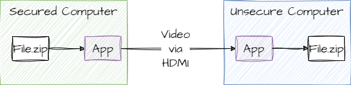

# HDMI File Transporter

[](https://github.com/MrDesjardins/hdmifiletransporter)
[](https://crates.io/crates/hdmifiletransporter)
[](https://docs.rs/hdmifiletransporter/latest/hdmifiletransporter)
[](https://github.com/MrDesjardins/hdmifiletransporter/actions/workflows/rust.yml)
[](https://codecov.io/gh/MrDesjardins/hdmifiletransporter)

This repository is a Rust implementation for a proof-of-concept to transfer files using video by leveraging HDMI from one computer and USB on a second computer. The computer sending the information might be in a secured environment with very restricted access to Internet or USB devices that can be connected. However, monitors are rarely a source targeted by security. Thus, the concept is to send files using HDMI and captured using a video card with USB on a second computer with no security restriction.



For details about the concept and code visit these articles:

1. [How to Transfer Files Between Computer Using HDMI (Part 1: Plan)]()
1.
1.
1.

# Information for the Consumers of the Library


## Install

```sh
cargo add hdmifiletransporter
```

# Information for the Consumers of the CLI

todo: Different options we can use with the CLI

# Information for the Developers of the Repository
This section is intended for developers who are contributing to this repository. They are few pointers to how to perform development tasks.

## What to Install?

You need to install the right toolchain:

```sh
rustup toolchain install stable
rustup default stable
```

To perform test coverage you need to install

```sh
cargo install grcov
rustup component add llvm-tools-preview
```

To generate benchmark plots you need to install GnuPlot

```sh
sudo apt update
sudo apt install gnuplot

# To confirm that it is properly installed:
which gnuplot
```

To use opencv on WSL:

```sh
sudo su 
apt install libopencv-dev clang libclang-dev
sudo apt install cmake
```

## Execute

To get all options using `cargo run`:

```sh
cargo run -- -help
```

## Tests

```sh
cargo test
```

## Tests Coverage

You must install few components before running coverage:

```sh
cargo install grcov
rustup component add llvm-tools-preview
```

Then, you can run:

```sh
./coverage.sh
```

Further explanation in the [Mozilla grcov website](https://github.com/mozilla/grcov)

## Documentation
The documentation is generated from the source code using:

```sh
cargo doc --open  -document-private-items
```

## Testing CLI

All commands for the user works but instead of using 

```sh
hdmifiletransporter -m inject -i testAssets/test1.zip -o out1.mp4
```

You need to use:

```sh
cargo run -- -m inject -i testAssets/text1.txt -o outputs/out1.avi --fps 30 --height 1920 --width 1080 --size 1
```

# Benchmark

```sh
cargo bench
```

# Publishing

## Test the Cargo Content

```sh
cargo package --allow-dirty
```

Then go to `hdmifiletransporter/target/package/` to see the content

## Push a new Cargo Package

```sh
cargo login
cargo publish --dry-run
cargo publish
```
