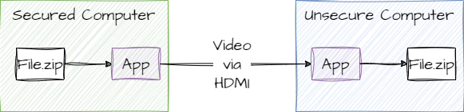

# HDMI File Transporter

[](https://github.com/MrDesjardins/hdmifiletransporter)
[](https://crates.io/crates/hdmifiletransporter)
[](https://docs.rs/hdmifiletransporter/latest/hdmifiletransporter)
[](https://github.com/MrDesjardins/hdmifiletransporter/actions/workflows/rust.yml)
[](https://codecov.io/gh/MrDesjardins/hdmifiletransporter)

This repository is a Rust implementation for a proof-of-concept to transfer files using video by leveraging HDMI from one computer and USB on a second computer. The computer sending the information might be in a secured environment with very restricted access to Internet or USB devices that can be connected. However, monitors are rarely a source targeted by security. Thus, the concept is to send files using HDMI and captured using a video card with USB on a second computer with no security restriction.



For details about the concept and code visit these articles:

1. [How to Transfer Files Between Computer Using HDMI (Part 1: Plan)](https://patrickdesjardins.com/blog/how-to-transfer-files-between-computers-using-HDMI-Part-1-Plan)
1. [How to Transfer Files Between Computers Using HDMI (Part 2: Prototype Code Video Creation)](https://patrickdesjardins.com/blog/how-to-transfer-files-between-computers-using-HDMI-Part-2-prototype-code-video)
1. [How to Transfer Files Between Computers Using HDMI (Part 3: Reading Video)](https://patrickdesjardins.com/blog/how-to-transfer-files-between-computers-using-HDMI-Part-3-reading-video)
1. [How to Transfer Files Between Computers Using HDMI (Part 4: HDMI Failure)](https://patrickdesjardins.com/blog/how-to-transfer-files-between-computers-using-HDMI-Part-4-hdmi-failure)
1. [How to Transfer Files Between Computers Using HDMI (Part 5: Instruction Header)](https://patrickdesjardins.com/blog/how-to-transfer-files-between-computers-using-HDMI-Part-5-instruction-header)
1. [How to Transfer Files Between Computers Using HDMI (Part 6: Instruction and Black and White)](https://patrickdesjardins.com/blog/how-to-transfer-files-between-computers-using-HDMI-Part-6-instruction-black-white)
1. [How to Transfer Files Between Computers Using HDMI (Part 7: Pagination)](https://patrickdesjardins.com/blog/how-to-transfer-files-between-computers-using-HDMI-Part-7-pagination)

# Scope of this Code Base

The code base contains a Rust script that inject a file into a video file. Also, it does the other side: from video file to file.

What is out of scope is the HDMI part. The details can be found in the several articles written.

# Information for the Consumers of the Library


## Install

```sh
cargo add hdmifiletransporter
```

# Information for the Consumers of the CLI

The CLI accepts the following options:

| Short | Long              | Description                                                              | Default       |
| ----- | ----------------- | ------------------------------------------------------------------------ | ------------- |
| `-m`  | `--mode`          | `inject` (file into video) or `extract` (file from video). Required.     | -             |
| `-i`  | `--input-file-path`  | Inject: file to embed. Extract: the video file to read.               | `video.mkv`   |
| `-o`  | `--output-video-path` | Inject: the produced video file. Extract: the recovered file.        | `video.mkv` / `mydata.txt` |
| `-a`  | `--algo`          | `rgb` (3 bytes/pixel), `bw` (1 bit/pixel, most robust) or `quantized` (N levels/channel, tunable). | `rgb`         |
| `-l`  | `--levels`        | Levels per channel for `quantized` (power of two, 2..=256). `2` = 3 bits/cell, maximally separated; `256` = raw RGB. | `4`           |
| `-f`  | `--fps`           | Frames per second of the produced video.                                 | `30`          |
| `-w`  | `--width`         | Frame width in pixels.                                                    | `3840`        |
| `-g`  | `--height`        | Frame height in pixels.                                                   | `2160`        |
| `-s`  | `--size`          | Pixels (width and height) used to encode one value. Must divide width/height. | `1`     |
| `-p`  | `--show-progress` | Print progress information (`true`/`false`).                             | `false`       |

The output video uses a lossless codec (FFV1 in an `.mkv` container) so the
extracted file is identical to the injected one. A lossy container such as
`.mp4` would corrupt the embedded bytes.

## Surviving a real HDMI capture (registration + per-frame CRC)

When the video is shown over HDMI and read back through a capture card, the
captured frame is no longer pixel-perfect: it can be offset, scaled, slightly
rotated, overscanned and re-compressed (MJPEG/YUV420). To make extraction
reliable, every frame now carries:

- A **calibration ring**: a white quiet-zone border with three QR-style
  concentric-square *finder patterns* in the top-left, top-right and
  bottom-left corners. On extraction, the decoder locates the three patterns,
  computes an affine transform from their centres to the known canonical
  positions, and warps the captured frame back to exact `width` x `height`
  pixels so the cell grid lines up again. The asymmetry (only three corners)
  fixes orientation. Frames where the three patterns cannot be found are
  skipped; because the source plays the video in a loop they will be captured
  cleanly on another pass.
- A **per-frame header** (just inside the ring) holding the frame type
  (`Start`/`Data`), a value (total byte count for `Start`, page number for
  `Data`) and a **CRC32** over the type, value and payload. On extraction the
  CRC is recomputed and any frame that does not match is dropped, so torn or
  garbled transition frames can never corrupt the output. The `Start` frame is
  identified by its validated header type rather than by its red colour (the
  red fill is kept only as a human visual cue).

**Black & white (`-a bw`) is the HDMI-grade mode.** Encoding one bit per cell
(black/white) tolerates the chroma subsampling and compression of a capture
card; the bundled capture-simulation tests prove byte-exact recovery in BW mode
after offset, rescaling and JPEG compression. RGB mode packs three bytes per
cell and is far more sensitive to colour loss, so it is best-effort over a real
HDMI link.

**Quantized colour (`-a quantized -l <levels>`) sits between the two.** Each
colour channel carries one of `levels` evenly spaced values (a power of two),
i.e. `log2(levels)` bits per channel and `3*log2(levels)` bits per cell:

| `--levels` | bits/cell | spacing between values | density vs BW |
| ---------- | --------- | ---------------------- | ------------- |
| `2`        | 3         | 255 (max, like BW)     | 3x            |
| `4`        | 6         | 85                     | 6x            |
| `8`        | 9         | 36                     | 9x            |
| `256`      | 24        | 1 (equals raw RGB)     | 24x           |

Lower `levels` keeps the colours far apart (resilient), higher `levels` packs
more bits (denser). `-a quantized -l 2` is byte-exact through the same simulated
HDMI capture path as BW (see `test_capture_simulation_quantized_2_levels_recovers_exact_bytes`)
while carrying 3x the data per cell. The header is always written black/white,
so it is protected regardless of the payload density.

> **Breaking change / re-encode required.** This frame format (calibration ring,
> header layout and CRC) is not compatible with videos produced by older
> versions. Re-encode your files with this version before extracting.

Out of scope for now: forward error correction (e.g. Reed-Solomon) to *correct*
errors rather than just detect them, and an ACK/retransmission protocol. The CRC
here detects and drops bad frames and relies on the looped stream for
redelivery.

# Information for the Developers of the Repository
This section is intended for developers who are contributing to this repository. They are few pointers to how to perform development tasks.

## What to Install?

You need to install the right toolchain:

```sh
rustup toolchain install stable
rustup default stable
```

To perform test coverage you need to install

```sh
cargo install grcov
rustup component add llvm-tools-preview
```

To generate benchmark plots you need to install GnuPlot

```sh
sudo apt update
sudo apt install gnuplot

# To confirm that it is properly installed:
which gnuplot
```

To use opencv on WSL:

```sh
sudo su 
apt install libopencv-dev clang libclang-dev
sudo apt install cmake
```

## Execute

To get all options using `cargo run`:

```sh
cargo run -- --help
```

## Tests

All tests:

```sh
cargo test
```

Only integration tests:

```sh
cargo test --test "*"
```

## Tests Coverage

You must install few components before running coverage:

```sh
cargo install grcov
rustup component add llvm-tools-preview
```

Then, you can run:

```sh
./coverage.sh
```

Further explanation in the [Mozilla grcov website](https://github.com/mozilla/grcov)

## Documentation
The documentation is generated from the source code using:

```sh
cargo doc --open  -document-private-items
```

## Testing CLI

All commands for the user works but instead of using 

```sh
hdmifiletransporter -m inject -i testAssets/test1.zip -o out1.mkv
```

### Inject Text to Video

```sh
cargo run -- -m inject -i testAssets/text1.txt -o outputs/out1.mkv --fps 30 --height 1080 --width 1920 --size 1 -p true

cargo run -- -m inject -i testAssets/text1.txt -o outputs/out1.mkv --fps 30 --height 1080 --width 1920 --size 1 -p true -a bw

```
### Extract Text from Video

```sh
cargo run -- -m extract -i outputs/out1.mkv -o outputs/text1.txt --fps 30 --height 1080 --width 1920 --size 1 -p true

cargo run -- -m extract -i outputs/out1.mkv -o outputs/text1.txt --fps 30 --height 1080 --width 1920 --size 1 -p true -a bw
```
# Benchmark

Micro timing benchmark (criterion):

```sh
cargo bench
```

## Resilience + speed benchmark

To find the best `algo`/`size`/resolution for moving a file losslessly over a real
HDMI capture, run the resilience benchmark. It sweeps BW vs RGB, several cell
sizes, and resolutions, pushes every frame through a simulated HDMI capture
(offset + anisotropic rescale + JPEG) at increasing severity, and checks the
payload is reconstructed byte-for-byte.

```sh
cargo run --release --bin benchmark
```

Optionally benchmark a real file instead of the synthetic payload:

```sh
cargo run --release --bin benchmark -- testAssets/test1.zip
```

The simulated capture models the main real-world distortions: positional
offset/overscan, anisotropic rescaling, per-frame sub-pixel jitter, a
limited-range/brightness/contrast remap, additive sensor noise, and a JPEG
(MJPEG-style) round-trip.

It also runs a **color-variance study**: BW is robust because it uses only two
colours 255 apart, while RGB packs more data but neighbouring values (254 vs
255) are easily confused after compression. The study sweeps the number of
levels per channel (the spacing between symbols) and measures decode accuracy,
showing how much spacing is needed to be reliable and how many bits/cell that
buys versus BW.

It writes these reports to the repo root:

- `benchmark_results.md` - per-resolution tables (bytes/frame, frame count,
  playback throughput at `fps`, encode/decode time, PASS/FAIL at each capture
  severity), a **Recommendation** of the most resilient-yet-fast config, and the
  color-variance results.
- `benchmark_results.csv` - one raw row per config/severity.
- `color_variance.csv` - accuracy per (severity, levels-per-channel).
- `color_variance.svg` - accuracy-vs-levels line chart (one line per severity).

Rule of thumb: BW is the HDMI-grade mode (1 bit/cell, robust); RGB is denser but
fragile. Larger `size` survives more distortion at the cost of a longer video.

## Large-file transfer planner

The planner answers "what `levels`/`spacing`/`bits`/`size`/`fps` move a 1/10/50 MB
file fastest *without corruption*?". It encodes payload with a real
N-levels-per-channel codec (powers of two: 2 levels = 1 bit/channel = 3 bits/cell,
up to 256 = raw 8-bit), pushes each frame through the full capture simulation and
geometric registration, decodes by centre sampling, and checks byte-exact
recovery. Because the source loops the video and every frame is CRC-checked, the
file is always reconstructed without corruption - a flakier (denser) config just
needs more loops, so the planner optimises **transfer time**.

```sh
# planner only (skips the multi-minute matrix)
BENCH_MODE=planner cargo run --release --bin benchmark
# matrix + color-variance only
BENCH_MODE=matrix cargo run --release --bin benchmark
# everything (default)
cargo run --release --bin benchmark
```

It writes `planner_results.md` / `planner_results.csv`: per-(size, levels)
reliability at each severity (single-pass frame survival + byte-error rate), a
**transfer-time table** for 1/10/50 MB across 30/60/120 fps (expected video loops
x frames / fps, accounting for CRC retransmission), and a density-vs-time
trade-off so over-packing is visible.

Finding: only **2 levels/channel (3 bits/cell, max spacing)** survives `Harsh`/`Brutal`
in one pass; every denser setting fails per-frame and becomes effectively
unusable (needs unboundedly many loops). Recommended for HDMI: 2 levels/channel
at `size 6` (1080p) - e.g. ~48 s on-wire for 50 MB at 60 fps; use `size 8` for the
roughest (`Brutal`) channels.

# Publishing

## Test the Cargo Content

```sh
cargo package --allow-dirty
```

Then go to `hdmifiletransporter/target/package/` to see the content

## Push a new Cargo Package

```sh
cargo login
cargo publish --dry-run
cargo publish
```

# Debugging

You must install [CodeLLDB](https://marketplace.visualstudio.com/items?itemName=vadimcn.vscode-lldb) if you want to set break point with VsCode.

# Real HDMI Transfer (verified workflow)

A full **source → HDMI → USB capture card → file** transfer was completed
successfully (June 2025). The important lessons:

- **Source:** inject and loop `transfer.mkv` at **1920×1080, 30 fps** (unchanged).
- **Capture:** run `ffmpeg` in **Windows PowerShell**, not WSL (`-f dshow` is
  Windows-only). Use **`-c:v copy`** — do not re-encode to FFV1 during live
  capture.
- **Extract:** on WSL, convert the Windows capture from MJPEG to FFV1 first
  (OpenCV cannot read the raw capture), then run extract with the **same flags
  as inject**.

**Step-by-step commands, pitfalls, and checklist:**
[docs/runbook-windows-wsl.md](docs/runbook-windows-wsl.md)

Quick Windows capture (after inject at 30 fps):

```powershell
ffmpeg -y -rtbufsize 200M -f dshow -video_size 1920x1080 -framerate 30 -i video="USB Video" -c:v copy "$env:USERPROFILE\Videos\captured.mp4"
```

For the full inject / convert / extract commands, use the runbook above.

# Other Bins
There is another bin called `colorframe`. It creates a small video with colors that change around the edge for testing purposed of the capture card.

```sh
cargo run --bin=colorframe
cargo run --bin=diagonal
```